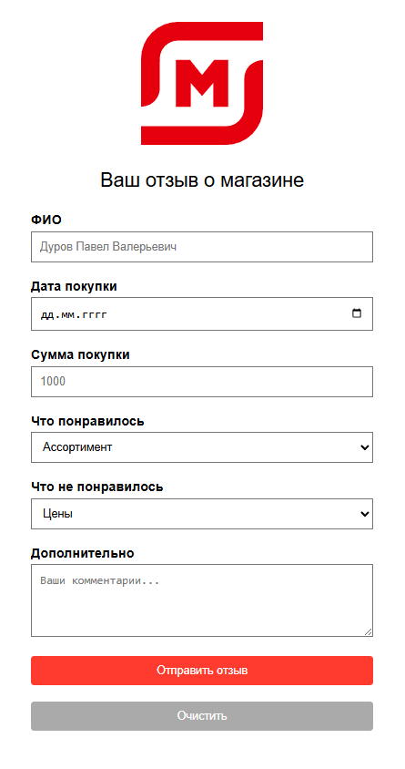

# Magnit Feedback Form

Educational feedback form for a retail store, made as a college project about user feedback forms.

The project is a small static website where a customer can choose a store branch, set a rating, select what they liked or disliked, and leave an additional comment.

> This is an unofficial educational project. It is not connected with the real Magnit company.

## Live Demo

[Open GitHub Pages](https://ilyushkaa7.github.io/magnit-feedback/)

## Screenshot

## Features

- Customer name input
- Store branch selection
- Five-star rating
- Dynamic lists for positive and negative feedback
- Limit of 5 selected items per feedback block
- Form validation before submission
- Reset button that clears added fields
- Responsive layout for desktop and mobile screens

## Tech Stack

- HTML
- CSS
- JavaScript
- GitHub Pages

## My Role

I made this project during college while HTML, CSS, and JavaScript were not part of our main program yet. I studied the basics myself, built the form, added the JavaScript logic, and explained how the code works during the assignment.

## Project Notes

The form is a frontend demo. It does not send data to a real server. After validation, it shows a success message to simulate feedback submission.

The main goal was to practice:

- semantic form structure
- basic styling
- simple JavaScript validation
- dynamic creation of form fields
- preparing a small website for GitHub Pages
